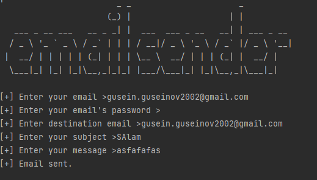

<h1>Email Sender</h1>

This is simple python code to send emails from terminal.

Note: Before run this code go to your <a href="https://gmail.com">gmail account</a> select "Manage your google account".

Go to security-> Turn off "2-step verification" and "Use your phone to sign in".

Go to "Less secure app access" and turn on.

This is how it looks like.

